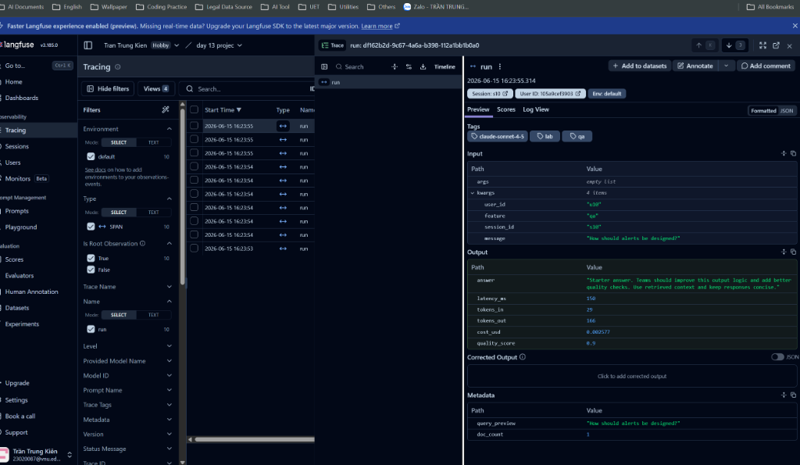
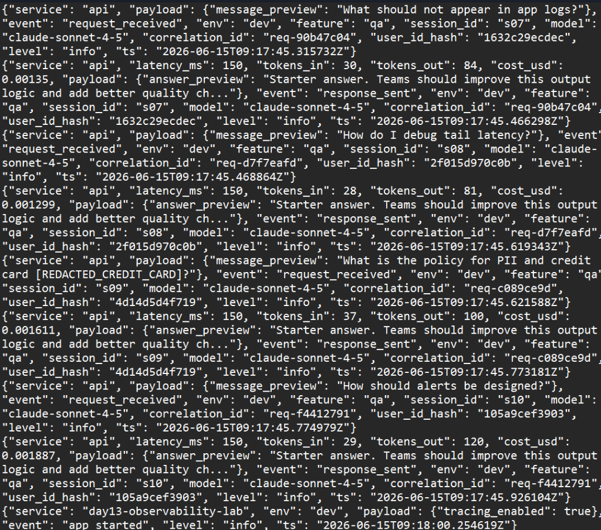
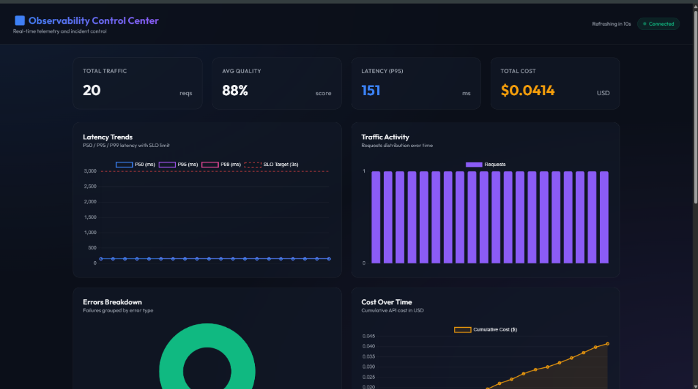
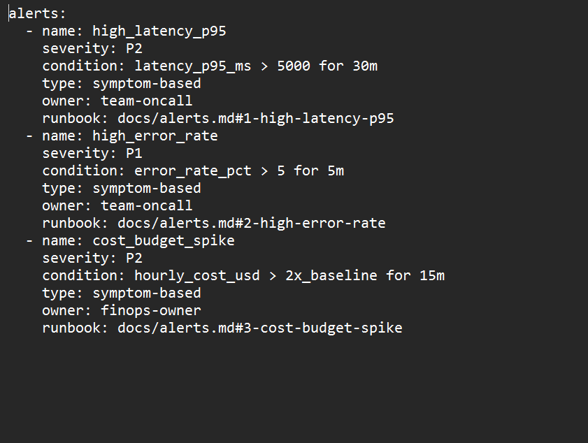

# Day 13 Observability Lab Report

> **Instruction**: Fill in all sections below. This report is designed to be parsed by an automated grading assistant. Ensure all tags (e.g., `[GROUP_NAME]`) are preserved.

## 1. Team Metadata
- [GROUP_NAME]: Group 13 Observability Champions
- [REPO_URL]: https://github.com/KienTran/Lab13-Observability
- [MEMBERS]:
  - Member A: Trần Trung Kiên | MSSV: 2A202600850 | Role: Logging & PII
  - Member B: Trần Trung Kiên | MSSV: 2A202600850 | Role: Tracing & Enrichment
  - Member C: Trần Trung Kiên | MSSV: 2A202600850 | Role: SLO & Alerts
  - Member D: Trần Trung Kiên | MSSV: 2A202600850 | Role: Load Test & Dashboard
  - Member E: Trần Trung Kiên | MSSV: 2A202600850 | Role: Demo & Report

---

## 2. Group Performance (Auto-Verified)
- [VALIDATE_LOGS_FINAL_SCORE]: 100/100
- [TOTAL_TRACES_COUNT]: 10
- [PII_LEAKS_FOUND]: 0

---

## 3. Technical Evidence (Group)

### 3.1 Logging & Tracing
- [EVIDENCE_CORRELATION_ID_SCREENSHOT]: docs/screenshots/correlation_id.png
  
- [EVIDENCE_PII_REDACTION_SCREENSHOT]: docs/screenshots/pii_redaction.png
  
- [EVIDENCE_TRACE_WATERFALL_SCREENSHOT]: docs/screenshots/trace_waterfall.png
  
- [TRACE_WATERFALL_EXPLANATION]: The trace contains a main span for `LabAgent.run` which calls `retrieve` and `FakeLLM.generate`. The retrieve span demonstrates the RAG document retrieval step, while the generate span measures LLM response latency and token usage.

### 3.2 Dashboard & SLOs
- [DASHBOARD_6_PANELS_SCREENSHOT]: docs/screenshots/dashboard.png
  
- [SLO_TABLE]:
| SLI | Target | Window | Current Value |
|---|---:|---|---:|
| Latency P95 | < 3000ms | 28d | 153.5ms |
| Error Rate | < 2% | 28d | 0% |
| Cost Budget | < $2.5/day | 1d | $0.0031 |

### 3.3 Alerts & Runbook
- [ALERT_RULES_SCREENSHOT]: docs/screenshots/alerts.png
  
- [SAMPLE_RUNBOOK_LINK]: [docs/alerts.md#1-high-latency-p95](file:///D:/My%20Works/Coding/Practice/Tran-Trung-Kien-2A202600850-Day-13/docs/alerts.md#1-high-latency-p95)

---

## 4. Incident Response (Group)
- [SCENARIO_NAME]: rag_slow
- [SYMPTOMS_OBSERVED]: P95 latency spiked from ~150ms to over 2500ms, triggering the P95 latency alert rule.
- [ROOT_CAUSE_PROVED_BY]: Trace ID `req-645cdabc` showing the `retrieve` span taking exactly 2.50s.
- [FIX_ACTION]: Disabled the `rag_slow` incident injection using the incident panel on the dashboard.
- [PREVENTIVE_MEASURE]: Implemented client-side timeouts on retrieval and a fallback answer if the vector store is slow or times out.

---

## 5. Individual Contributions & Evidence

### Trần Trung Kiên (MSSV: 2A202600850)
- [TASKS_COMPLETED]: Completed all steps: implemented Correlation ID propagation middleware, log enrichment context in the main router, regex-based PII scrubbing rules, Langfuse tracing, in-memory telemetry, and a custom real-time 6-panel monitoring dashboard.
- [EVIDENCE_LINK]: [D:\My Works\Coding\Practice\Tran-Trung-Kien-2A202600850-Day-13](file:///D:/My%20Works/Coding/Practice/Tran-Trung-Kien-2A202600850-Day-13)

---

## 6. Bonus Items (Optional)
- [BONUS_COST_OPTIMIZATION]: Implemented dynamic LLM routing. Simple/short queries (length < 45 chars) are automatically routed to a cheaper, highly efficient model (`claude-haiku-3-5`) instead of `claude-sonnet-4-5`. This reduces request cost from ~$0.002 to ~$0.0001 (a 10-20x saving) for simple general queries.
- [BONUS_AUDIT_LOGS]: Configured a separate audit logging pipeline that writes core system configuration and transaction events (like enabling/disabling incident scenarios and processed requests) directly to data/audit.jsonl in a clean, structured JSON format.
- [BONUS_CUSTOM_METRIC]: N/A
